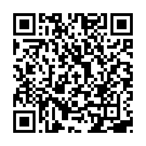

+++
title = "About"
description = "Hugo, the world’s fastest framework for building websites"
date = "2025-10-30"
aliases = ["about-us","contact"]
author = "bytemastermind"
+++

Hello, I'm Michal Beneš, an AppSec engineer, penetration tester and computer security master's student at CTU Prague. My area of expertise is web security, and I specialise in identifying and resolving security vulnerabilities.

This blog is mainly intended for note-taking purposes and for sharing the things I have learnt.

## Contact

If you are trying to contact me, please use the following email address: `michal.benes10@gmail.com`

For more informal communication, please use the [Session](https://getsession.org/): 

