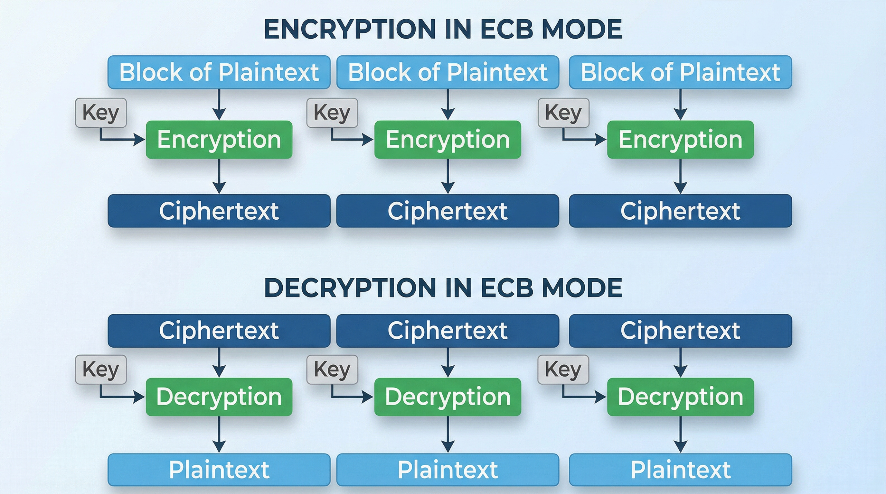

## Introduction

The lab is available [here](https://portswigger.net/web-security/logic-flaws/examples/lab-logic-flaws-authentication-bypass-via-encryption-oracle) also with an available solution. While I was reading their solution, I thought that it's very much in the style of "click here, press that" and that it forgets to explain why, although the reasoning and understanding the system behind it is the most valuable thing that one can get from this lab.

I won't be repeating the things that are already written in the original solution, just a few for the context. But I can guarantee you that when you will understand what I will try to tell you, you will be able to finish the lab without any other help.

## What is Available?

The main point of this lab is that we have a system that allows us these two operations AND the system is using the same encryption and key FOR BOTH (let's call it the oracle):

- Encrypt ANY plaintext $m$ into ciphertext $c$, where before encryption, the server every time puts a constant prefix before $m$. Can be written as $notification = E(p \cdot m) = c$
- Decrypt ANY ciphertext into plaintext

Mentioned facts can be easily deduced from encrypting a text (the server returns `notification` cookie) and then decrypting it back again (the `notification` goes to the server and it returns it decrypted). 

Furthermore, the `stay-logged-in` cookie can be decrypted via the same oracle. That is a little bit of luck as different cookie could theoretically use completely different cryptosystem. Decrypted `stay-logged-in` cookie is in the format `username:timestamp`.

Thus, we can encrypt text `administrator:timestamp`. But remember, it will be encrypted alongside with the prefix `Invalid email address: `, can be written as $E(\text{"Invalid email address: administrator:timestamp"}) = c$. The only way to get the ciphertext of `administrator:timestamp` and not the `Invalid email address: administrator:timestamp` is to somehow extract it from the ciphertext itself. That is the missing piece of the puzzle.

## Understanding the Server Process

We need to understand a few more things about the server's cryptosystem and process which will allow us to extract just what we need from the ciphertext.

- If we play around with the oracle, we can see that there are often `%xx` substrings in the ciphertexts. That would probably mean **URL encryption**.
- If we use previous fact and try to URL decode some of the ciphertexts, there are often `=` characters. That is a huge hint, because `=` are used as padding in **Base64**.

Based on this we can assume that the server encrypts the text, then encodes it in Base64 and finally URL encodes it. Thus the clear ciphertext can be obtained from the cookie value by URL decoding it and then Base64 decoding it.

Let's edit the formula so it is more accurate:

$$
notification = URLEncode(Base64Encode(E(p \cdot m))) = c
$$

If we want to focus on the properties of the cipher $E()$ by for example comparing the lengths of the plaintexts and ciphertexts, we should aim to URL decode and Base64 decode the cookie values first, to look at the raw bytes that come out of the function $E()$.

If we increase the length of the plaintext by $n$ bytes, will be the length of the ciphertext by $n$ bytes longer? If we encrypt string `123` (server will actually encrypt `Invalid email address: 123`) we will get 32 bytes long ciphertext. If we encrypt string `12345`, we will get again 32 bytes long ciphertext. The most probable explanation of this is padding! The system takes message of $n$ bytes and before encrypting, it adds $m - n$ bytes after our plaintext, creating a block of $m$ bytes! 

But what if our text alone has $m + 1$ bytes? Well, another block of $m$ bytes will be created, in which $m - 1$ bytes will be the padding! Thus, if we increase the length of the plaintext byte by byte, at some point we should see a ciphertext that is by $m$ bytes longer than the 32 bytes that we measured with our first plaintexts!

Remember, 23 bytes of text (`Invalid email address: `) is added before our plaintext before encrypting. If we encrypt `123`, the resulting plaintext will have 26 bytes. If we encrypt `1234`, the resulting plaintext will have 27 bytes and so on.

If we encrypt `123456789`, the total plaintext (including prefix) is 32 bytes. The ciphertext is also 32 bytes. However, if we add just one more character (123456789a), the plaintext becomes 33 bytes, but the ciphertext jumps to 48 bytes! This jump of 16 bytes ($48 - 32$) confirms the block size.

You may ask, how it can be useful? Well, there exists an encryption mode, ECB that is depicted on the following picture, where the blocks of ciphertext are not dependent on each other. In that case, if we delete one of the ciphertext blocks, the following blocks would still be successfully decrypted. In other modes like CBC, deleting one of the ciphertext blocks would have direct influence on decrypting of the following ciphertext blocks.

## Using ECB to Crack it

If we are lucky and the server uses ECB mode, we could use it to our advantage! Remember, we need to generate a valid ciphertext for the plaintext `administrator:timestamp` but we have only ciphertext of the plaintext `Invalid email address: administrator:timestamp`. We need to somehow delete the `Invalid email address: ` part from the ciphertext to say it naively. With ECB we could potentially do that! We know the prefix `Invalid email address: ` is 23 bytes long. To finish the second block (which ends at byte 32), we need exactly 9 bytes of 'garbage' padding ($23 + 9 = 32$)

We know that `Invalid email address: ` takes 23 bytes, which spans into 2 blocks of 16 bytes, where the second block is padded. If we fill the remaining bytes of the second block ourselves, we can force our `administrator:timestamp` to start exactly at the beginning of the 3rd block!

Thus if we encrypt `123456789new block` the server will encrypt `Invalid email address: 123456789new block`. The first two blocks contain `Invalid email address: 123456789` and the third block contain `new block` with padding after it! If ECB mode is used, these two blocks are encrypted independently. We could simply take the resulting ciphertext, cut off the first 32 bytes, and what remains is the valid ciphertext for `new block`.

And after trying to decrypt the third block alone, we get `new block`! That confirms that the server is using a block cipher in ECB mode! If we send 9 bytes of padding followed by our target payload `123456789administrator:timestamp`, the server will produce a ciphertext where the first 32 bytes correspond to the prefix and our padding, and the subsequent blocks correspond to our target payload (properly padded by the server). We then simply delete those first 32 bytes of ciphertext and get a valid stay-logged-in cookie for administrator!
